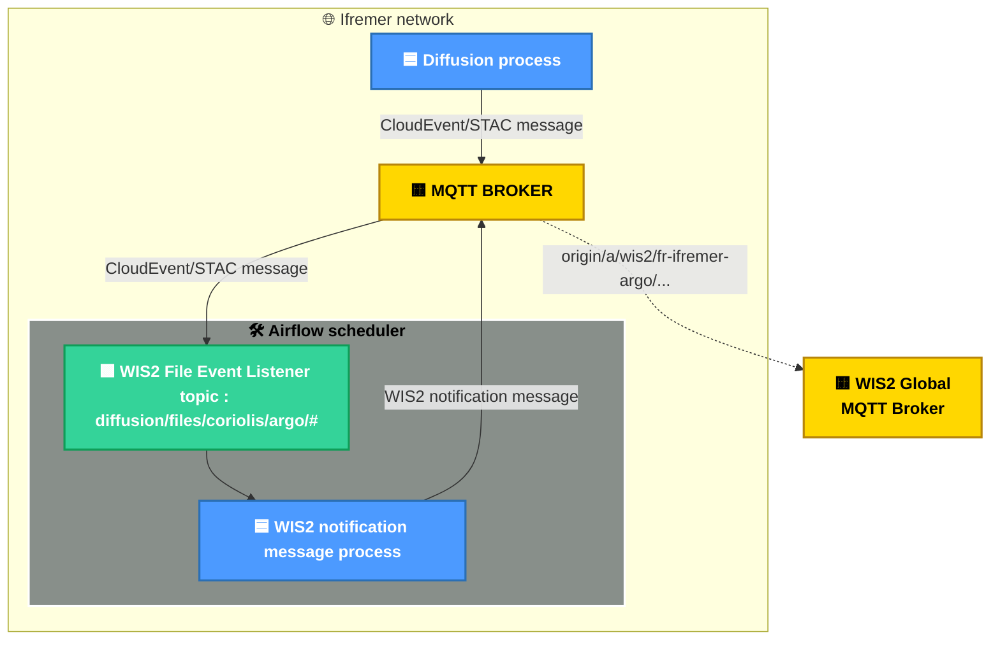

# Résumé

Ce projet illustre une chaîne de traitement permettant de créer, valider et publier un message sur le [WMO Information System](https://community.wmo.int/en/activity-areas/wis/wis2-implementation) (WIS 2.0).

Le principe repose sur l'envoi d'un événement dès qu'un fichier de données est déposé dans un système de fichiers (développement hors périmètre du projet). Cet événement est transmis via un broker MQTT (Mosquitto) et capté par un ordonnanceur (Airflow), qui lance les traitements nécessaires pour générer et envoyer une notification au WMO Information System.

Pour la démonstration, le cas d'usage Argo est utilisé, mais ce processus est conçu pour être adaptable à toute source de données, à condition de développer l'émission d'un événement lors de la création du fichier de données initial.

## Outils / Technologies

Liste des outils et technologies utilisés :

- `Mosquitto` : Broker de message MQTT, utilisé pour faire trensiter le évènements / notifications
- `Airflow` : Ordonnanceurs qui s'abonne au broker MQTT ordonne les traitements en fonction des évènements reçus.
- `Python` : Les traitement dédiés au WIS2 sont écrit en python et utilise les librairies suivantes :
  - `Paho` : Client broker MQTT Python pour publier et souscire aux topics.
  - `pywis_pubsub` : Permet de valider des message de notification type data.
  - `pywcmp` : Permet de valider des message de notification type WMO WIS Core Metadata Profile (WCMP).

## Architecture



## Oganisation

Le projet est organisé comme suis :

- `broker/` : Répertoire contenant les données et configuration du boker MQTT
- `scheduleur/` : Répertoire contenant les données et configuration de l'ordonnanceur Airflow
- `data/` : Répertoire contenant des données pour les tests
- `compose.yml` : Fichier de configuration Docker Compose définissant les services à éxécuter pour dérouler toute la chaine de publication d'un message de notification pour un fichier de données.

## Configuration

- `broker/config` : contient le fichier de configuration mosquitto
- `broker/data` : contient les configuration des utilisateur et des droits sur les topics mosquitto

- `sceduler/config` : Configuration Airflow
- `sceduler/dags` : Dags Airflow
- `sceduler/logs` : Logs Airflow
- `sceduler/plugins` : Plugins Airflow

## Services

### Metadata

La gestion des métadonnées n'est pas incluse dans la démonstration, car elle ne nécessite qu'une seule exécution. Cependant, le principe reste le même. Un exemple de [fichier JSON **Core Metadata Profile**](/data/core-metadata/fr-ifremer-argo-core-metadata.json) est disponible dans le répertoire des données de test. Ce fichier doit être hébergé sur un serveur web et accessible librement sur Internet. À partir de ce Core Metadata Profile, il faut générer un message de notification WIS2 et le publier sur le broker global WIS2, sur le topic dédié. Par exemple, pour Argo :

```bash
mqttx pub -h localhost --debug -p 8081 -l ws -u wis2-argo-rw -P "wis2-argo-rw" --path / -t origin/a/wis2/fr-ifremer-argo/metadata -m "$(cat ./data/notification-message/core-metadata-msg-notification.json)"
```

### Data

Microservices décrit dans les fichiers `compose.yml` :

1. `broker/compose.yml` : 1 microservice [Mosquitto](https://devops.ifremer.fr/development/tools/message/mosquitto), broker de messages qui implémente le protocole MQTT, permet de faire transiter les envènements (création d'un fichier de données) et les notifications (notification message WIS2).
2. `scheduler/compose.yml` : 9 microservices permettant d'executer la solution d'ordonnancement Airflow locallement ([plus d'informations sur la documentation officielle](https://airflow.apache.org/docs/apache-airflow/stable/howto/docker-compose/index.html)). C'est avec Airflow que l'on va déclencher une chaine de traitement (création d'un notification message WIS2) à chaque fois qu'un évènement réceptionné (création d'un fichier de données).
3. `event-message-diffusion` : 1 microservice simulant la création d'un évenement de diffusion nouveau fichier Argo.
4. `notification-message-receipt` : 1 microservice simulant le global broker WIS2, il reçoit les notification messages.

## Get Started

Pour simuler la publication d'un message de notification sur un broker WIS2 à la réception d'un événement de création d'un fichier de données Argo, suivez la procédure suivante :

- Démarrez les microservices Mosquitto et Airflow avec Docker :

```bash
docker compose up
```

- Une fois le processus terminé, arrêtez et supprimez les conteneurs :

```bash
docker compose down
```
