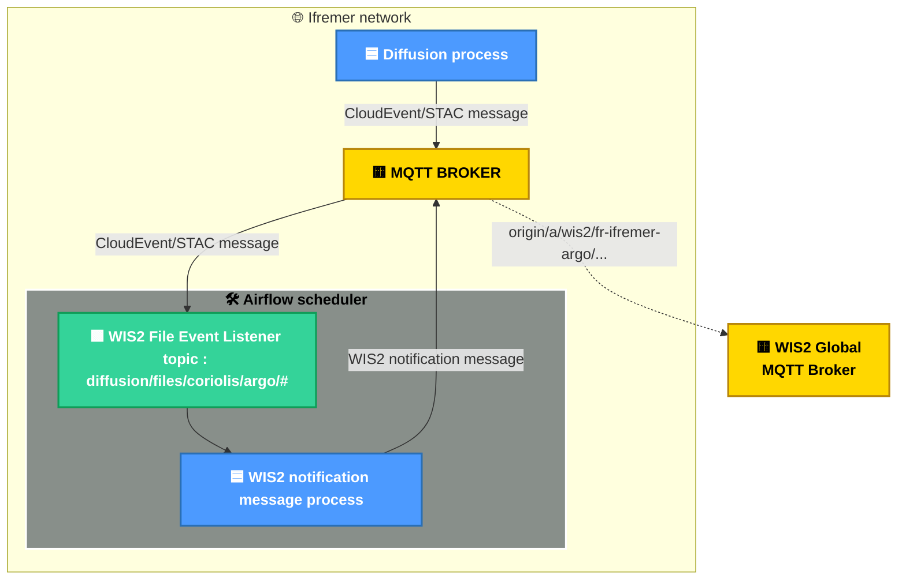

# Résumé

Ce projet illustre une chaîne de traitement permettant de créer, valider et publier un message sur le [WMO Information System](https://community.wmo.int/en/activity-areas/wis/wis2-implementation) (WIS 2.0).

Le principe repose sur l'envoi d'un événement dès qu'un fichier de données est déposé dans un système de fichiers (développement hors périmètre du projet). Cet événement est transmis via un broker MQTT (Mosquitto) et capté par un ordonnanceur (Airflow), qui lance les traitements nécessaires pour générer et envoyer une notification au WMO Information System.

Pour la démonstration, le cas d'usage Argo est utilisé, mais ce processus est conçu pour être adaptable à toute source de données, à condition de développer l'émission d'un événement lors de la création du fichier de données initial.

## Outils / Technologies

Liste des outils et technologies utilisés :

- `Mosquitto` : Broker de message MQTT, utilisé pour faire trensiter le évènements / notifications
- `Airflow` : Ordonnanceurs qui s'abonne au broker MQTT ordonne les traitements en fonction des évènements reçus.
- `Python` : Les traitement dédiés au WIS2 sont écrit en python et utilise les librairies suivantes :
  - `Paho` : Client broker MQTT Python pour publier et souscire aux topics.
  - `pywis_pubsub` : Permet de valider des message de notification type data.
  - `pywcmp` : Permet de valider des message de notification type WMO WIS Core Metadata Profile (WCMP).

## Architecture



## Oganisation

Le projet est organisé comme suis :

- `broker/` : Répertoire contenant les données et configuration du boker MQTT
- `scheduleur/` : Répertoire contenant les données et configuration de l'ordonnanceur Airflow
- `data/` : Répertoire contenant des données pour les tests
- `compose.yml` : Fichier de configuration Docker Compose définissant les services à éxécuter pour dérouler toute la chaine de publication d'un message de notification pour un fichier de données.

## Configuration

- `broker/config` : 
- `broker/data`

- `sceduler/config`
- `sceduler/dag`
- `sceduler/logs`
- `sceduler/plugins`

## Services

TODO

4 microservices :

1. **broker** : service Mosquitto qui fonctionne en tant que broker MQTT.
2. **create-data-message** : service Python qui créé un message de notification à partir d'un fichier de données dans le répertoire `/data`.
3. **validate-data-message** : service Python qui valide un message de notification pour un fichier de données dans le répertoire `/data`.
4. **publish-data-message** : service Python qui publie un message de notification pour un fichier de données sur le topic `origin/a/wis2/fr-ifremer-argo/core/data/ocean/surface-based-observations/drifting-ocean-profilers`.

<!-- ## Metadata

Le projet démarre 5 services :

1. **broker** : service Mosquitto qui fonctionne en tant que broker MQTT.
2. **validate-metadata** : service Python qui valide fichier JSON de type **Core Metadata Profile** dans le répertoire `/data`.
3. **create-metadata-message** : service Python qui valide fichier JSON de type **Core Metadata Profile** dans le répertoire `/data`.
4. **validate-metadata-message** : service Python qui valide un message de notification à envoyer pour le fichier de métadonnées.
5. **publish-metadata** : service Python qui publie un message de notification pour les fichier de métadonnées sur le topic `origin/a/wis2/fr-ifremer-argo/metadata` après validation. -->

## Get Started

Afin de simuler la publication d'un message de notification sur un broker du WIS2 suivre la procédure suivante :

1. Dépose le fichier de données dans le repertoire `/data`
2. Référencez votre fichier de données d'entrée et le fichier JSON de sortie de type notification message dans le fichier `.env`
3. Exécuter les commandes Docker ci dessous :

```bash
docker compose up --build
```

Une fois le process terminé, supprimer des conteneurs :

```bash
docker compose down
```

## Notes

### Messages

Fichier de metadonnées à déposer sur le serveur apache contenant les données puis envoyer un message de notification sur : origin/a/wis2/fr-ifremer-argo/metadata

Fichier de message de notification

id : générer un uuid
pubtime: date génération du fichier
metadata_id : identifiant unique après urn:wmo:md:fr-ifremer-argo ?
intégrity : hashage du fichier
datetime : date de l'observation
link :
 type : specifique pour netcdf ? pour buffer :
 taille : a setter proprement

Connexion au broker de test par mail
