# Summary

This project demonstrates a processing chain for creating, validating, and publishing a message on the [WMO Information System](https://community.wmo.int/en/activity-areas/wis/wis2-implementation) (WIS 2.0).

The process is triggered when a data file is stored into a file system (this part is out of scope for this project). This event is transmitted via an MQTT broker (Mosquitto) and captured by a scheduler (Airflow), which schedule the processing chain to generate, validate and send a notification to the WMO Information System.

For demonstration purposes, the Argo use case is implemented. However, this workflow is designed to be adaptable to any data source, provided that an event is emitted when a new data file is created.

## Tools / Technologies

List of tools and technologies used:

- `Mosquitto`: MQTT message broker used to transmit events and notifications.
- `Airflow`: Scheduler that subscribes to the MQTT broker and orchestrates processing based on received events.
- `Python`: Processing tasks dedicated to WIS2 are written in Python and use the following libraries:
  - `Paho`: Python MQTT client for publishing and subscribing to topics.
  - `pywis_pubsub`: Validates data notification messages.
  - `pywcmp`: Validates notification messages of type WMO WIS Core Metadata Profile (WCMP).

## Architecture

```mermaid
flowchart TB;
%% Styles améliorés
classDef filesystem fill:#FFD700,stroke:#B8860B,stroke-width:2px,color:#000,font-weight:bold;
classDef process fill:#0A89B0,stroke:#08637F,stroke-width:2px,color:#fff,font-weight:bold;
classDef broker fill:#007acc,stroke:#005f99,stroke-width:2px,color:#fff,font-weight:bold;
classDef listener fill:#34D399,stroke:#0F9D58,stroke-width:2px,color:#fff,font-weight:bold;
classDef airflow fill:#888f8a,stroke:#ffffff,stroke-width:2px,color:#000,font-weight:bold;

%% Réseau interne - Ifremer WIS2 Node
subgraph internal_network["🔗 Ifremer WIS2 Node"]
  broker_ifremer["📨 Ifremer Broker"]:::broker

  %% Serveur Web sécurisé
  subgraph https_server_subgraph["🌐 HTTPS Server"]
    data_filesystem["🗂️ Argo Data Files"]:::filesystem
    diffusion_process["⚙️ Argo Event Processor"]:::process
  end

  %% Planification des tâches - Airflow
  subgraph airflow_subgraph["🗓️ Airflow Scheduler"]
    mqtt_listener["🎧 Event Listener"]:::listener
    notification_message_process["📦 WIS2 Message Generator"]:::process
  end

  %% Connexions internes
  data_filesystem -->|new file| diffusion_process
  diffusion_process -->|CloudEvent/STAC message| broker_ifremer
  broker_ifremer -->|CloudEvent/STAC| mqtt_listener
  mqtt_listener -->|Trigger Notification| notification_message_process
  notification_message_process -->|WIS2 Notification| broker_ifremer
end

%% Noeuds externes
broker_wis2["📨 WIS2 Global Broker"]:::broker

%% Connexions externes
broker_wis2 -->|origin/a/wis2/fr-ifremer-argo/...| broker_ifremer

```



## Organization

The project is structured as follows:

- `broker/`: Directory containing MQTT broker data and configuration.
- `scheduler/`: Directory containing Airflow scheduler data and configuration.
- `src/`: Directory containing sources dedicated to wis2 data processing chain. These sources are packaged in a container and run with scheduler thanks to Apptainer
- `data/`: Directory containing test data.
- `compose.yml`: Docker Compose configuration file defining the services required to execute the full notification message publication process.

## Configuration

- `broker/config`: Contains the Mosquitto configuration file.
- `broker/data`: Contains user configurations and topic permissions for Mosquitto.

- `scheduler/config`: Airflow configuration.
- `scheduler/dags`: Airflow DAGs.
- `scheduler/logs`: Airflow logs.
- `scheduler/plugins`: Airflow plugins.
- `scheduler/data`: Airflow externalised DAGs data, to store event / notifications from the DAGs in case of error

### Airflow API connection

The MQTT listener needs to create downstream DAG runs via the Airflow REST API. Add an HTTP connection named `airflow_api` in the Airflow UI (Admin → Connections) or via CLI so the plugin can authenticate without hard-coding tokens:

```bash
airflow connections add airflow_api \
  --conn-type http \
  --conn-host http://airflow-webserver:8080 \
  --conn-login airflow \
  --conn-password airflow
```

At runtime the sensor exchanges the stored username/password for a short-lived bearer token (`POST /api/v1/security/login`). The token is then used to trigger DAG runs (`POST /api/v2/dags/<dag_id>/dagRuns`), so no secret or token ever appears in the source code or the task logs.

## Services

### Metadata

Metadata management is not included in this demonstration since it only needs to be executed once. However, the process follows the same principle. An example of a [JSON **Core Metadata Profile** file](/data/core-metadata/fr-ifremer-argo-core-metadata.json) is stored in the test data directory. This file must be hosted on a web server with a publicly accessible URL. From the **Core Metadata Profile**, a [WIS2 notification message](/data/notification-message/core-metadata-msg-notification.json) must be created and published to the global WIS2 broker on the dedicated topic. For example, for Argo:

- Using Docker + mqttx (*Important* : QoS = 1 for persistance)

```bash
docker run --rm --network host -e MQTT_MESSAGE="$(cat ./data/core-metadata/fr-ifremer-argo-core-metadata.json)" emqx/mqttx-cli:v1.11.1 sh -c 'mqttx pub -h localhost --debug -p 8081 -l ws -u prod-files-rw -P prod-files-rw --path / -t diffusion/files/coriolis/argo/bufr -q 1 -m "$MQTT_MESSAGE"'
```

### Data

Microservices described in Docker compose files, the entrypoint compose file is `scheduler/compose.yml` :

1. `broker/compose.yml`: A [Mosquitto](https://devops.ifremer.fr/development/tools/message/mosquitto) microservice implementing the MQTT protocol to transmit events (data file creation) and notifications (WIS2 notification message).
2. `scheduler/compose.yml`: Airflow official Docker compose file, describe 9 microservices enabling local execution of the Airflow scheduler ([official documentation](https://airflow.apache.org/docs/apache-airflow/stable/howto/docker-compose/index.html)).
3. `scheduler/compose.override.yml` : Custom compose file for our needs. This file override the official Airflow compose file. (use custom image with Apptainer and specific libraries (paho-mqtt, ...) installed)

Follow dedicated section to [run the system with Docker](#get-started), once the system is running properly, you can simulate a file diffusion event from a message in your file system with Docker and [`mqttx` client](https://mqttx.app/downloads?os=linux) :

```bash
docker run --rm --network host -e MQTT_MESSAGE="$(cat ./data/event-message/bufr/bufr-creation-cloudevent.json)" emqx/mqttx-cli:v1.11.1 sh -c 'mqttx pub -h localhost --debug -p 8081 -l ws -u prod-files-rw -P prod-files-rw --path / -t diffusion/files/coriolis/argo/bufr -q 1 -m "$MQTT_MESSAGE"'
```

## Get Started

To simulate the publication of a notification message on a WIS2 broker upon receiving an Argo data file creation event, follow these steps:

- Start the Mosquitto and Airflow microservices and simulate Argo file diffusion using Docker:

```bash
cd scheduler
docker compose up
```

- Simulate again Argo file diffusion using Docker [see data section](#data).
- After usage, stop and remove the containers:

```bash
docker compose down
```

- Cleaning up : to stop and delete containers, delete volumes with database data and download images

```bash
docker compose down --volumes --rmi all
```

## Classic Use Case

Once the application is running locally, access the Airflow web interface at <http://localhost:8080> using the default credentials (`airflow` / `airflow`).

Filter the view to show only active DAGs. You will see the three DAGs related to this project:


- `📂 Argo - Listen Argo file diffusion events`: This DAG subscribes to file diffusion topics on the MQTT broker. When a file diffusion event is received, it triggers a DAG to validate the message.
- `✅ Argo - Validate & process diffusion event message` : It validate the message received from diffusion and trigger the WIS2 notification message processing DAG.
- `🔔 WIS2 - Argo notification message`: It processes, validates, and publishes a WIS2 notification message.

Click on each DAG to inspect the status of individual tasks.

---

## What to Do in Case of an Error?

If an error occurs during the `🔔 WIS2 - Publish notification message` process, a copy of the original event is saved when received. You can find and edit the message stored : `./scheduler/data/{{dag_id}}/{{run_id}}/{{task_id}}.json`

| Method                      | Recommended?   | Advantages                  | Drawbacks                           |
| --------------------------- | -------------- | --------------------------- | ----------------------------------- |
| ✅ Re-trigger with conf     | ✅ YES         | Clean, traceable, resilient | Creates a new DAG run               |
| 🔁 Clearing tasks          | ⚠️ Sometimes | Quick                       | May re-run already successful tasks |
| 🔧 Modifying existing conf | ❌ NO          | Not possible (by design)    | Unsafe and unsupported              |

### ✅ To fix and retrigger

This solution is the cleanest because actions are tracable and resilent.

#### Option 1 : Using Airflow REST APIs

💡 **Tip**: Use the following command to list DAG runs and retrieve the `run_id` and `execution_date`:

```bash
curl -X GET "http://localhost:8080/api/v1/dags/{{dag_id}}/dagRuns" --user "airflow:airflow"
```

- Edit the saved event message

```bash
# Edit the CloudEvent message
vim ./scheduler/data/{{dag_id}}/{{run_id}}/{{task_id}}.json
```

- Trigger a new DAG run with the updated configuration

```bash
curl -X POST "http://localhost:8080/api/v2/dags/{{dag_id}}/dagRuns" \
  -H "Content-Type: application/json" \
  --user "airflow:airflow" \
  -d '{
    "conf": '"$(cat ./scheduler/data/{{dag_id}}/{{run_id}}/{{task_id}}.json)"'
  }'
```

- Clean up stored message after successful reprocessing

```bash
rm -Rf ./scheduler/data/{{dag_id}}/{{run_id}}
```

- Document the recovery on the failed DAG run (Status and comment)

#### Option 2 : Using the command line

⚠️ **Warning** : you need to be connected to the server where airflow is running.

💡 **Tip**: Use the following command to list DAG runs and retrieve the run_id and execution_date:

```bash
docker exec -it wis2-mqtt-broker-airflow-worker-1 airflow dags list-runs -d {{dag_id}}
```

- Edit the saved event message

```bash
# Edit the CloudEvent message
vim ./scheduler/data/{{dag_id}}/{{run_id}}/{{task_id}}.json
```

- Trigger a new DAG run with the updated configuration

```bash
docker exec -it wis2-mqtt-broker-airflow-worker-1 airflow dags trigger \
  -c "$(cat ./scheduler/data/{{dag_id}}/{{run_id}}/{{task_id}}.json)" \
  {{dag_id}}
```

- Clean up stored message after successful reprocessing

```bash
rm -Rf ./scheduler/data/{{dag_id}}/{{run_id}}
```

- Document the recovery on the failed DAG run (Status and comment)

### 🔁 To fix and retry – From the Airflow web interface

This solution is Quicker but as it's not tracable, it is not the best option.

#### Option 1 – Using the command line

```bash
# Edit the CloudEvent message
vim ./scheduler/data/{{dag_id}}/{{run_id}}/{{task_id}}.json

# Clear and rerun the DAG after editing
docker exec -it wis2-mqtt-broker-airflow-worker-1 airflow tasks clear wis2-publish-message-notification \
  -s "2025-04-15T15:00:47" \
  -e "2025-04-15T15:00:48" \
  --yes
```

💡 **Tip**: To retrieve the exact `dag_run` execution date:

```bash
docker exec -it wis2-mqtt-broker-airflow-worker-1 airflow dags list-runs -d wis2-publish-message-notification
```

#### Option 2 - From the Airflow web interface

1. After fixing the message stored depending on the error:  
   `./scheduler/data/{{dag_id}}/{{run_id}}/{{task_id}}.json`
2. Open the Airflow UI at [http://localhost:8080](http://localhost:8080)
3. Click on the DAG and locate the failed run:  
   
4. Click the **"Clear"** button and choose **"Clear existing tasks"**:  
   
